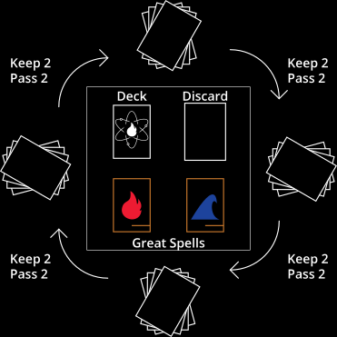

<!-- {:.inline-block .custom-underline-red .pt-10}
# Jekyll + Tailwind

{:.lead}
Minimal boilerplate for [Jekyll](https://jekyllrb.com/) sites and [Tailwind CSS](https://tailwindcss.com/). -->

<!-- arrow to scroll to top, accent underline to show page vertical progress -->

<!-- https://developer.mozilla.org/en-US/docs/Web/CSS/transform-function/rotate3d() -->
<!-- 1150 850 430 px -->

<!-- replace box with still image for mobile? -->

<!-- 
design: gorgeous, sleek, minimal, modern design, hand crafted to create something that you can feel good about owning

articles
- what makes a good game
- testing a wide variety of audiences
- luck vs skill in game design
- user experience in game design

more
- tools (tracker, sample hand)
- print and play
- faq
- card gallery (search, sortable table, stats in charts)
- specs
- rules
- tracker
- testimonial/reviews/videos (quotes, articles, press, and more)
- branding guidelines
- about us / our story
- backers list

bottom:
- contact / enter email for maillist
- copyright with year
- socials

rotating card carousel early on page (between how to play and design)

rules page (separate has read online, print and play, faqs, link to youtube)

card gallery on mobile shows table/list and opens in modal with arrows or swipe to go back or next, permalink to cards

contact:
- btn to message on fb, or email

youtube:
how to play (3min)
basic strategy (3min)
advanced strategy (5min)
watch it played (8min)

page for variants: elements.website/variants, linked to in rules

insert images under gameplay and design

add more interesting btn icon hover effects (get users to click kickstarter btn)

use heroicons for non brands, download brand fontawesome icons

https://tailwindcomponents.com/component/toggle-switch

 -->

<section id="home">
    
  

    

    	

			

				

				

				

				

				

				

			

    	

      <!--  -->
    

    

      <h1 id="hero-text" class="sm:text-3xl text-2xl mb-4" style="line-height: 1.25;">ELEMENTS
         is a simple, speedy, spell-slinging party game
      </h1>
      
<b class="dropcap">T</b>ake part in a one-of-a-kind battle royale experience for 2-8 players. Play begins by dealing 4 cards to each player. Players pick 1 card to keep and pass the remaining cards. Once players have selected their hands, they battle it out by casting the spells they selected to blast their enemies with fire, heal with water, craft gems, or counter or reflect the opposition with electricity. Win by being the last one standing, or reaching 20 gems first; the choice is yours.  <a href=""><i class="fab fa-youtube"></i> Learn to play in 3 min.</a>

      

        <!-- <button class="inline-flex text-white bg-indigo-500 border-0 py-2 px-6 focus:outline-none hover:bg-indigo-600 rounded text-lg">Button</button> -->
        <!-- <button class="ml-4 inline-flex text-gray-400 bg-gray-800 border-0 py-2 px-6 focus:outline-none hover:bg-gray-700 hover:text-white rounded text-lg">Button</button> -->
        <button class="btn m-2 kickstarter"><i class="fab fa-kickstarter-k"></i>  Kickstarter</button>
        <!-- <button class="btn m-2"><i class="fas fa-book-open"></i>  Learn More</button> -->
        <button class="btn m-2"><i class="fas fa-share"></i>  Share</button>
      

    

  

</section>

<section id="gameplay" class="mx-4">
	 
	

	<h1 class="text-center sm:text-3xl text-2xl mb-4">Gameplay</h1>

  

    

        
    

    

        
<b>Life and Gems</b>

        
<b class="dropcap">E</b>ach player starts with 20 life and 0 gems. If you reach 20 gems, you win the game. If you run out of life, you lose the game. Be the last one standing or the first to 20 gems to claim victory.

    

  

  

    

        
<b>The Four Elements</b>

        
<b class="dropcap">T</b>he Elements deck is a deck of 80 spells. There are four elements: fire, water, gem, and electric. Fire spells deal damage. Water spells heal damage. Gem spells craft gems. Electric spells counter other spells. Master the elements to emerge victorious. Each spell has a power and a target. The power determines the size of the effect, and the target determines who is affected.

    

    

        
    

  

  

    

        
    

    

        
<b>Combining and Overpowering</b>

        
<b class="dropcap">Y</b>ou can combine and overpower spells of the same element type. You may combine multiple spells of the same element into a single spell. When doing this, combine their power and select any target from among those spells. You may overpower a spell by responding immediately after it was cast by casting another spell of the same element type and greater power. This negates the previous spell and casts your spell.

    

  

  

    

        
<b>Round Structure</b>

        
<b class="dropcap">E</b>ach round, players select spells, then take turns casting one spell per turn or passing the turn. When all players have passed the turn in a row, the round ends and a new round begins. Rounds continue until a player wins the game.    During selection, each player sets aside their previous hand, then draws 4 cards. They chose 2 to keep and 2 to pass (clockwise). Players then combine these cards with their previous hand, and discard down to 4 cards. After selection, players cast their spells. Each player may cast up to one spell per turn.

    

    

        
    

  

  

    

        
    

    

        
<b>Great Spells</b>

        
<b class="dropcap">A</b>fter selection, players can elect to purchase a Great Spell for 8 gems. A player can only purchase one Great Spell per game. Great Spells do not take up hand space.

    

  

  
Games are fast-paced and exciting, with each player trying to anticipate their opponents and adapt their strategy as the game evolves. Utilize your resources efficiently, predict your opponents, and select the right cards to survive.

  

Footnotes
 Determining who goes first: Randomly determine the starting player for the first round. Future rounds start with the first player to pass.  Discarding: players secretly discard, then reveal their discarded cards.  Running out of cards: If the deck runs out of cards, shuffle the discard pile into the deck.  Ties: If multiple players reach 20 gems at the same time, the player with the greatest gem total wins. If there is a tie, the player with the greatest life wins. If there is a tie, the current player wins. If multiple players reach 0 life at the same time, players lose clockwise starting with the caster.  Priority for responding to spells: priority for responding to spells goes clockwise starting from the caster. If a player responds, priority for responding to that goes clockwise from the player who cast the response. Spells can only affect the most recently cast spell.  Great Spells: Great Spells are revealed. A player cannot purchase a Great Spell another player controls. Upon casting a Great Spell, the player then returns it to the center. If a player loses the game, their Great Spell returns to the center. Priority for purchasing a Great Spell goes clockwise starting with the player who will start the round (the player who passed first).

</section>

<!-- todo: animate other diagrams on scroll -->

<section id="design" class="mx-4">
	 
	

	<h1 class="text-center sm:text-3xl text-2xl mb-4">Design</h1>

    

    <svg id="animated-cardback" xmlns="http://www.w3.org/2000/svg" viewBox="0 0 180 252">
    
    <rect class="cls-1" width="180" height="252"/>
    <text class="cls-2" transform="translate(17.39 225.23) scale(0.95 1)">ELEMENTS</text>

    <ellipse class="cls-3" cx="90" cy="108" rx="27" ry="81"/>
    <ellipse class="cls-3" cx="90" cy="108" rx="81" ry="27" transform="translate(-41.94 59.47) rotate(-30)"/>
    <ellipse class="cls-3" cx="90" cy="108" rx="27" ry="81" transform="translate(-48.53 131.94) rotate(-60)"/>

    <circle id="bigCircle" class="cls-1" cx="90" cy="108" r="36"/>
    <circle class="cls-5" cx="43.23" cy="62.08" r="4.5"/>
    <circle class="cls-5" cx="153.47" cy="90.31" r="4.5"/>
    <circle class="cls-5" cx="74.05" cy="171.55" r="4.5"/>
    <path id="fire" class="cls-8" d="M86.69,76.31c2.06.37,11.78,6.37,13.58,26.54a0,0,0,0,0,0,0c1.51-.44,3.68-4.9,1.62-11.41,0,0,0-.08,0,0,2.65,2.76,11.81,13.58,3.57,23.48v0c.18.74,2.39,1.73,3.71-.81,0,0,.08,0,.08,0-1.18,32.62-51.28,20.62-37.33-9.64,5.89-11.08,17.34-4,14.65-28.16C86.62,76.35,86.65,76.31,86.69,76.31Z"/>

    <rect id="border" class="cls-9" x="9" y="9" width="162" height="234"/>
    </svg>
    

    

	
<b class="dropcap">L</b>orem ipsum dolor sit amet, consectetur adipiscing elit. Nullam nec sollicitudin turpis. Integer congue faucibus ipsum, non commodo odio porta id. Praesent magna ipsum, tincidunt at viverra non, sollicitudin ut neque. Donec id erat nec erat interdum blandit vitae eget nulla. Nam porttitor condimentum ipsum id sollicitudin. Sed ac diam sed mi rutrum tincidunt. Ut vitae venenatis dolor. Quisque et interdum nunc, eu malesuada sem. Quisque volutpat dui sit amet ante pretium, quis finibus urna sagittis. Vivamus lorem justo, consequat imperdiet ullamcorper sed, tristique vel lacus. Vivamus est quam, dictum eget arcu dictum, vulputate cursus urna. Vivamus porta nisi arcu, ac tempus turpis tempus ac. Sed in quam mauris. Praesent dolor risus, aliquam eu nulla eget, semper porta dolor. Curabitur ut diam feugiat, tristique libero at, suscipit nunc.

</section>

<!-- ## Pages

<content class="grid md:grid-cols-2 gap-4">
    <a href="" class="flex items-center justify-center space-x-2 w-full text-center py-5 px-6 bg-gray-500 hover:bg-blue-500 rounded shadow whitespace-nowrap">
        <svg class="w-6 h-6" fill="currentColor" viewBox="0 0 20 20"><path d="M5 4a2 2 0 012-2h6a2 2 0 012 2v14l-5-2.5L5 18V4z"></path></svg>
        Demo article
    </a>
    
</content>

<button class="btn">Hello There</button> 

---

-->
